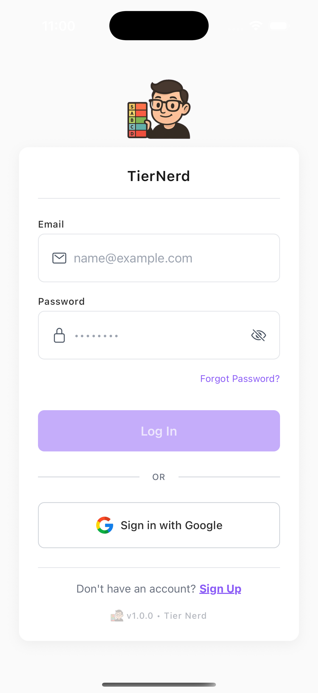
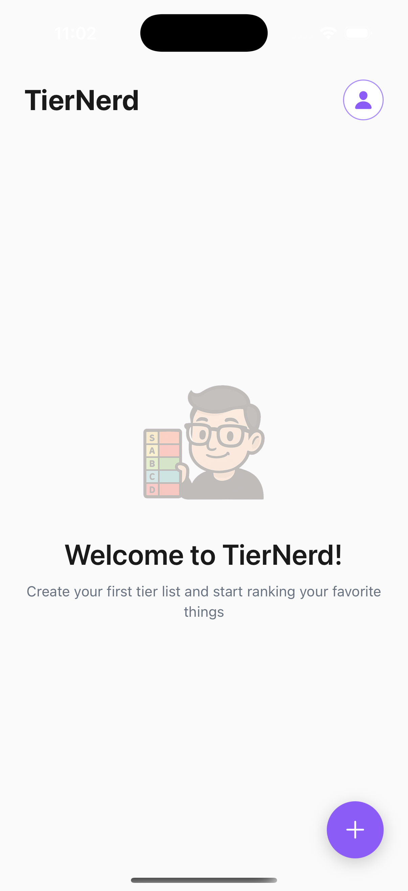

# TierNerd UI Pages Documentation

This document outlines the UI pages and user flows for the TierNerd application, reflecting the current implementation.

## Overview

TierNerd allows users to:
- Sign in with Google authentication
- Create customizable tier lists
- Add and rank items
- Organize items into tiers (S through F)
- View statistics and manage their profile

## Design Philosophy

- **Minimalistic**: Clean, white-based design with subtle accents
- **Consistent**: Uses design system tokens throughout
- **Accessible**: Clear visual hierarchy and touch targets
- **Smooth**: Subtle animations enhance user experience

## Pages

### 1. Login Screen

The entry point for unauthenticated users.

**Features:**
- Google Sign-In as primary authentication
- Email/password fields for future implementation
- Clean, centered design matching app aesthetic

**UI Elements:**
- TierNerd logo
- Email and password input fields with icons
- "Log In" button (currently uses mock auth)
- "Sign in with Google" button
- "Forgot Password?" link
- "Sign Up" link for new users
- Version info at bottom

**Design Details:**
- White form card on light gray background
- Purple accent color for primary actions
- Subtle shadows and borders
- Fade-in animation on load

### 2. Home Screen

The main hub after authentication, with clean cards and clear CTAs.

**Features:**
- Quick stats overview
- Recent lists display
- Prominent create action
- Profile navigation

**UI Elements:**
- **Header**: TierNerd logo + brand text, profile avatar button
- **Hero Section**: Large "Create New Tier List" button with icon
- **Stats Card** (when user has lists):
  - Total lists count
  - Total items count
  - Most used tier with color badge
- **Recent Lists Section**: Clean cards showing:
  - List title
  - Item count and last modified date
  - Chevron indicating interactivity
- **Secondary Actions**: "View All Lists" outlined button
- **Empty State** (for new users):
  - Faded logo illustration
  - Welcome message
  - "Create Your First List" CTA

**Design Details:**
- Fade and scale animations on load
- White cards with subtle shadows
- Clear visual hierarchy
- Consistent spacing using design tokens

### 3. Profile Screen

User profile and settings management.

**Features:**
- User information display
- Account settings access
- Sign out functionality
- App version info

**UI Elements:**
- **Header**: Back button, "Profile" title
- **User Info Card**:
  - Profile photo or placeholder
  - Display name
  - Email address
- **Settings Section**: List items for:
  - Account Settings
  - App Preferences
  - About
- **Sign Out Button**: Outlined style with red accent
- **Version Info**: Logo + version number

**Design Details:**
- Consistent with login screen aesthetic
- White cards on gray background
- Subtle red for sign out (not jarring)
- Fade-in animation

### 4. Lists Screen (To Be Implemented)

Overview of all user's lists.

**Features:**
- Grid or list view of all tier lists
- Search/filter functionality
- Sort options (recent, alphabetical, item count)
- Quick actions per list

### 5. List Detail Page (To Be Implemented)

Detailed view of a single list showing all items and their rankings.

**Features:**
- List metadata (title, description, creation date)
- Items organized by tier (S through F)
- Unranked items section
- Add new items directly within the list
- Edit list details
- Inline item comparison functionality

**UI Elements:**
- List header with metadata
- Tier sections (collapsible)
- Item cards within each tier
- Draggable items for manual tier adjustment
- Inline "Add Item" field
- Edit list details button
- Comparison overlay for ranking

### 6. Create/Edit List Page (To Be Implemented)

Interface for creating a new list or editing an existing one.

**Features:**
- Set list title and description
- Configure basic list settings
- Add initial items during creation

**UI Elements:**
- Form fields for list details
- Initial items section
- Save/Cancel buttons

## User Flows

### Authentication Flow

1. User opens app and sees Login Screen
2. User taps "Sign in with Google" (or uses email/password)
3. Authentication completes
4. User is taken to Home Screen

### Sign Out Flow

1. User taps profile avatar on Home Screen
2. Profile Screen opens
3. User taps "Sign Out" button
4. User returns to Login Screen

### Creating a New List (Future)

1. User taps "Create New Tier List" on Home Screen
2. Create List page opens
3. User enters title and description
4. User adds initial items (optional)
5. User saves list
6. System navigates to List Detail page

### Viewing Lists

1. From Home Screen, user can:
   - Tap a recent list card to view details
   - Tap "View All Lists" to see complete collection
2. List opens in detail view

### Profile Management

1. User taps profile avatar from Home Screen
2. Profile Screen opens with user info
3. User can access settings or sign out
4. Back button returns to previous screen

## Design System

### Color Palette

**Primary Colors:**
- Dominant (60%): White (#FFFFFF), Off-white (#FAFAFA)
- Secondary (30%): Dark gray (#2D2D2D), Near black (#1A1A1A)
- Accent (10%): Purple (#8B5CF6), Light purple (#A78BFA)

**Tier Colors:**
- S Tier: Gold (#FFD700)
- A Tier: Green (#4CAF50)
- B Tier: Blue (#2196F3)
- C Tier: Purple (#9C27B0)
- D Tier: Orange (#FF9800)
- F Tier: Gray (#9E9E9E)

**Semantic Colors:**
- Error: Red (#EF4444) - used sparingly
- Success: Green (#10B981)
- Info: Blue (#3B82F6)

### Typography

- **Brand Title**: Large, bold headers
- **Headlines**: Section titles
- **Body**: Regular content text
- **Labels**: Small UI labels

### Design Principles

1. **Minimalism**: Clean layouts with ample whitespace
2. **Consistency**: Unified design tokens across all screens
3. **Hierarchy**: Clear visual importance through size and contrast
4. **Accessibility**: Proper touch targets and readable text
5. **Animation**: Subtle, purposeful transitions

## Implementation Status

✅ **Completed:**
- Login Screen
- Home Screen
- Profile Screen
- Navigation structure
- Design system tokens

🚧 **In Progress:**
- Backend integration
- Authentication flow

📋 **To Do:**
- Lists Screen
- List Detail Page
- Create/Edit List
- Item ranking interface
- Comparison algorithm UI

## Technical Notes

- Built with React Native (Expo)
- TypeScript for type safety
- Design system with tokens for consistency
- Mock authentication for development
- Prepared for Google OAuth integration
